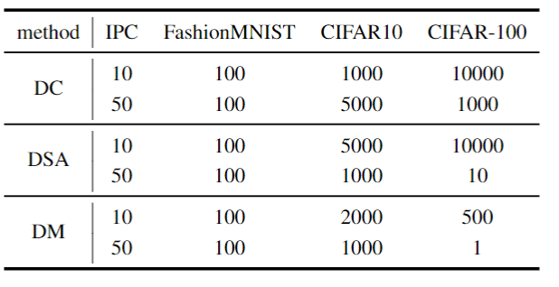

# Which Assessment Should be Prioritized in Dataset Distillation?

This is official code of paper "Which Assessment Should be Prioritized in Dataset Distillation?". 

> **Abstract:** Dataset Distillation (DD) is a prominent technique that encapsulates the knowledge from a large-scale dataset into a smaller, synthetic dataset. Currently, the standard evaluation procedure for DD involves training a validation model with the synthetic dataset and testing it on the original test set. It inevitably introduces additional cost for tuning the model training, and the procedure is inapplicable when the test set is unavailable. Therefore, we urgently need a more practical assessment to evaluate the quality of synthetic datasets. In this work, we perform a comprehensive empirical analysis on some previous matching metrics and various assessments at different levels of information, including images, features and semantics. We draw the conclusion that the classification accuracy of synthetic data on model trained on the original data, dubbed as Original Model (OM), has a strong correlation with the distillation performance. In addition, based on the observation, we propose an auxiliary regularizing term with the Classification Loss of pre-trained Original Model (CLOM) for stably guiding the optimization direction. Extensive experiments are conducted to validate that CLOM provides consistent performance improvement across multiple baselines. Our code is available at https://anonymous.4open.science/r/DDInterpreter-0DC5.

## Setup

Install packages in the `requirements.txt`.

## Train models on original dataset

The following command will train 10 ConvNet models on CIFAR-10.

```bash
python train.py --dataset CIFAR10 --model ConvNet --num 10
```

* Set `--num` to point how many models needed to be trained , and the pretrained models will be saved at`./pretrained_model/[dataset]/original/[model]`.
*  Use the default path of original dataset `./data/[dataset]` or set `--data_path` to specify the path.
*  Change `--model` to train models with different architectures, such as AlexNet, VGG11, ResNet18, et.

## CLOM

Execute following commands to generated synthesis dataset by using CLOM on the basic methods.

### DC+CLOM

```bash
python method/DC_DSA_DM/main.py --method DC --dataset CIFAR10 --model ConvNet --ipc 10 --alphas 2000 --models_pool ConvNet --model_num 10
```

### DSA+CLOM

```bash
python method/DC_DSA_DM/main.py --method DSA --dataset CIFAR10 --model ConvNet --ipc 10 --init real --dsa_strategy color_crop_cutout_flip_scale_rotate --alphas 1000 --models_pool ConvNet --model_num 10
```

### DM+CLOM

```bash
python method/DC_DSA_DM/main_DM.py --method DM --dataset CIFAR10 --ipc 10 --alphas 2000 --models_pool ConvNet --model_num 10
```

* The synthesis dataset will be saved at `./condensed/[dataset]/[method]/IPC[ipc]`
* Use the default path of original dataset `./data/[dataset]` or set `--data_path` to specify the path
*  `--alphas` ， `--models_pool` , and `model_num`  represent the weight of CLOM, the architecture of models and the number of each architecture  respectively. 

The weights utilized in our study are outlined below:



### CLOM with a model pool

Expansion of `--models_pool` and `--alphas` can result in expanding the matching model to a model pool.

Add new model architectures into `--models_pool` directly, and there are two available settings of `--alphas`.

1. Just set one weight for `--alphas` indicates that this weight is applied for all models used. For example:

   ```bash
   python method/DC_DSA_DM/main.py --method DC --dataset CIFAR10 --model ConvNet --ipc 10 --alphas 1000 --models_pool ConvNet AlexNet VGG11 ResNet18 --model_num 10
   ```

2. Let the quantity of weights in `--alphas`  match that of the  `--models_pool`.  Then, the weight values in  `--alphas`  correspond one-to-one with the models in `--models_pool`. In follow instance, the weights of ConvNet, AlexNet, VGG11, ResNet18 are 1000, 2000, 1000, 2000 respectively.

   ```bash
   python method/DC_DSA_DM/main.py --method DC --dataset CIFAR10 --model ConvNet --ipc 10 --alphas 1000 2000 1000 2000 --models_pool ConvNet AlexNet VGG11 ResNet18 --model_num 10
   ```

Below are the weights we employed for CLOM with a model pool on CIFAR-10 with 50 images per class:

.png)

## Validate synthesis dataset

The following command can validate synthesis dataset of DC with IPC10 on CIFAR-10

```bash
python validate.py --dataset CIFAR10 --method DC --ipc 50 --model ConvNet --dsa --normalize_data
```

*  Set ` --save_model` to save model.
